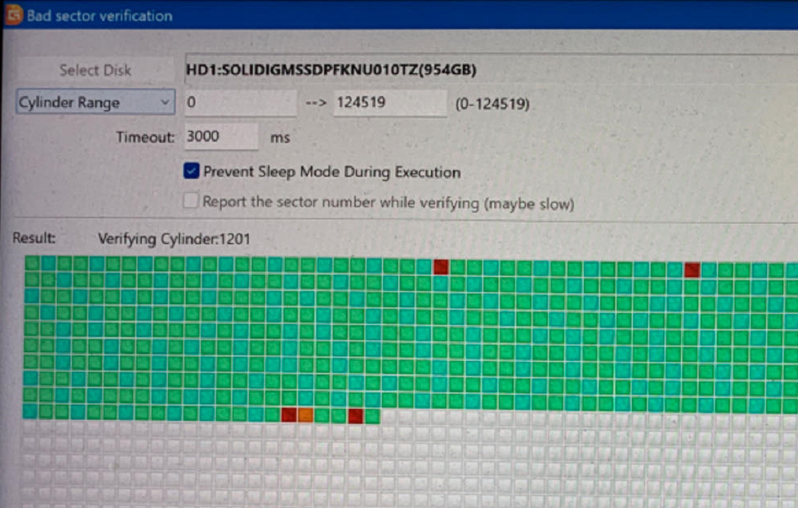

# rtl9210b-firmware

Many Thanks to @damnnfo at https://github.com/damnnfo/rtl9210b-firmware

# USE AT YOUR OWN RISK
# USE AT YOUR OWN RISK
# USE AT YOUR OWN RISK

## Problem arise
1. I use Ugreen CM559 10Gbps M.2 NVMe SATA Enclosure to reuse my replaced ssd in mini PC before.But when I
verify bad sectors using DiskGenius tool, many bad sectors show up and stuck for a long time when encounter
the bad sector.

2. At first, I think the ssd is broken. But when I inserted the ssd back to mini PC and checked again. No bad sector
shows up. So there is a problem about the Enclosure.

3. But my enclosure is out of supoort. So I do some search and found the repo https://github.com/damnnfo/rtl9210b-firmware . I give it a try and upgrade
the enclosure fireware. Then everything goes ok.

## Steps (USE AT YOUR OWN RISK and USE ONLY WHEN OUT OF OFFICAL SUPPORT)
1. **Make sure ssd is not in ssd enclosrue and in case of data loss.**

1. Download the repo zip from github and unzip.

1. View the `tools/G-M202-AC-10G-Mptols-For-RTL9210B-20220922/UTHSB_MPtool_Lite_v1.12.1.423/UTHSB_MPtool_Lite.exe` file property and check the digital sigature and make sure no virus.

1. Run the exe.

1. Plugin the ssd enclusure into pc and your enclosure will show up in the usb host controller tree and use `Device Select` to select your device.

1. Select the `Configure` , `Firmware Bin` and `Firmware GD` directory. Please note the selection is the directory contains the file inseted of the file itself. For me, I select `firmware` directory , `firmware` directory and `firmware/gdfw` for the 3 directory.
Please note then you should use **selection dropdown** to select right file. For me, I select `firmware/RTL9210B_CG_upqi.cfg` , `firmware/RTL9210B_v1.32.87.082923_signed.bin` and `firmware/gdfw/RTL9210B_gd_v4.30.23.071922.bin` for the 3 selections.
1. Then click `Update Device` button on the top left button. When progress bar goes end and shows ok. It's about a few seconds.

1. Insert your ssd in the enclosure and check bad sectors. You can select other version in dropdown box if my seelction not working for you, but USE AT YOUR OWN RISK.
